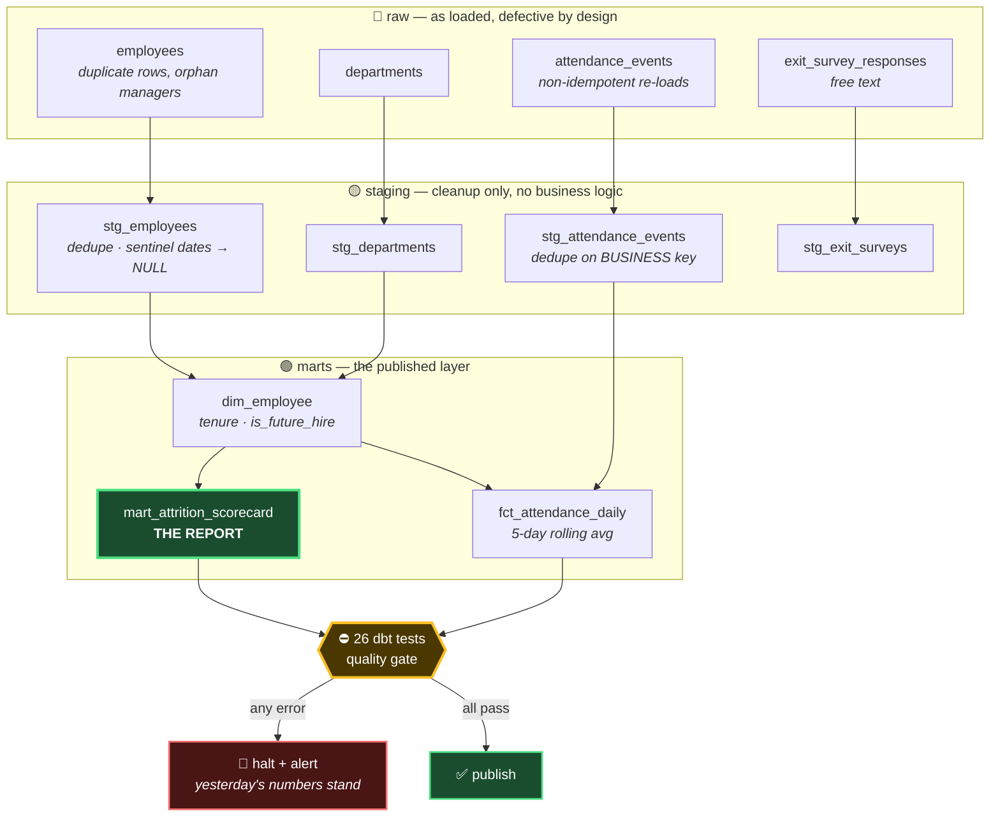
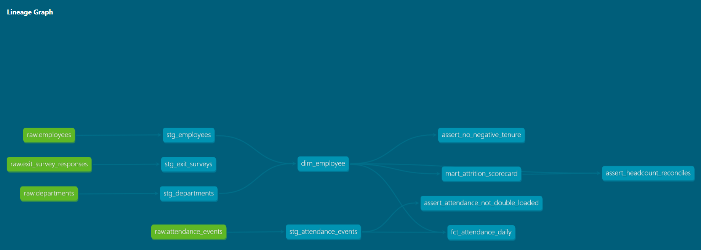

# HR Data Mart — a pipeline that refuses to publish numbers it can't vouch for

[](https://github.com/ksrinivasarao2012/hr-data-mart/actions/workflows/ci.yml)

A dbt + PostgreSQL pipeline that turns deliberately messy HR data into a monthly
attrition scorecard, and **halts instead of publishing when its own quality
checks fail**.

Every push runs the whole thing from scratch on a clean machine — fresh
Postgres, newly randomised defective dataset, 7 models, 26 tests. The badge
above is live.

📊 **[Browse the data lineage and model docs →](https://ksrinivasarao2012.github.io/hr-data-mart/)**

---

## The problem

An HR analyst builds an attrition number by hand each month. The source data is
dirty in the ways real HR data is dirty: people re-inserted after a team
transfer, managers who have already left, dates typed in the wrong locale, a
nightly load that silently ran twice.

A naive `SELECT` over that produces a number that is confidently, quietly wrong
— and it lands in a leadership deck.

This project automates the number **and** automates the reasons to distrust it.

---

## Architecture



**The arrow that matters is `GATE → HALT`.** Everything upstream computes
numbers. That one edge decides whether anyone is allowed to see them.

### Generated lineage

dbt derives this from the `ref()` calls in the SQL — nobody draws it by hand.
Explore it interactively in the
**[hosted docs](https://ksrinivasarao2012.github.io/hr-data-mart/)**.



One thing the graph cannot tell you: `assert_headcount_reconciles` is shown
guarding `mart_attrition_scorecard`, and it is correctly wired up — but
[Finding 2](#finding-2--a-reconciliation-test-that-cannot-fail) explains why
that test cannot actually fail. Lineage proves a test *exists*. Only reading the
SQL tells you whether it *checks* anything.

`run_pipeline.py` orchestrates this locally; `.github/workflows/ci.yml` runs it
in CI. `dags/hr_mart_daily.py` is the equivalent Airflow DAG — see
*Honest scope*.

---

## At a glance

| | |
|---|---|
| Rows processed | ~31K attendance events, ~500 employees, ~100 free-text surveys |
| Models | 7 (4 staging views, 3 mart tables) |
| Tests | 26 — generic, source, custom singular, and one hand-written reusable generic |
| Defect classes injected | 7, randomised per run |
| Data quality findings | 4, documented with root cause and remediation |
| Runs green in CI | on every push, against a dataset nobody has tested before |

---

## The SQL worth reading

**`mart_attrition_scorecard.sql`** — a month spine built with `generate_series`
so months with no activity show zero rather than vanishing from the report;
`lag()` to carry closing headcount into the next month's opening; a 3-month
rolling average over a `rows between 2 preceding and current row` frame; and a
year-partitioned cumulative `sum()` for leavers-to-date.

**`stg_attendance_events.sql`** — deduplicates on `(employee_id, event_ts,
event_type)` rather than on `event_id`. The re-run assigned *fresh* event ids,
so a `unique` test on `event_id` passes while the data is still doubled.
Surrogate-key uniqueness and business-key uniqueness are different questions.

**`tests/generic/test_unique_combination_of_columns.sql`** — a hand-written
generic test, because dbt's built-in `unique` only handles one column and
compound grain is normal in fact tables.

---

## Findings

The dataset is synthetic and defective by design. Defect counts and placement
are **randomised on every run** (clock-seeded; `--seed N` to reproduce), so the
tests have to catch defect *categories*, not the specific rows I planted.

The findings below came from investigating the data after the tests were
already green.

### Finding 1 — a month-based check misses a 17-day error

`assert_no_negative_tenure` originally keyed off `tenure_months < 0`. Employee
1118 has an exit date **17 days before** the join date — a DD/MM vs MM/DD entry
error. Seventeen days rounds to **0 whole months**, so the row sailed through.

```
 employee_id | join_date  | exit_date  | tenure_months
        1118 | 2024-12-23 | 2024-12-06 |             0
```

Confirmed by running two queries side by side: the direct date comparison
returned 4 rows, the `tenure_months < 0` version returned 3.

- **Impact:** an impossible employment record counted as a valid 0-month tenure,
  inflating the `0-1y` band and contributing a leaver to the wrong month.
- **Why it was missed:** the test asserted on a *derived, rounded* value instead
  of the raw fact. Rounding destroyed the evidence before the test saw it.
- **Fixed:** both the test and the scorecard filter now compare
  `exit_date >= join_date` directly.

### Finding 2 — a reconciliation test that cannot fail

`assert_headcount_reconciles` compares the published scorecard headcount against
an independent count. It passes.

It passes on wrong data.

For seed 702371: the generator created **500 distinct people**, but
`dim_employee` holds **503 rows** — because some people were entered under two
*different* `employee_id`s (same person, same email, new id issued after a
transfer). Both sides of the reconciliation read from `dim_employee`, so both
are inflated by exactly 3, and the two wrong numbers agree perfectly.

- **Impact:** headcount over-reported by ~0.6%; attrition rate understated,
  because the denominator is too large.
- **Why every test missed it:** `unique(employee_id)` passes (the ids genuinely
  differ). The staging dedupe partitions by `employee_id`, so it does nothing.
  And the reconciliation test compares a mart to the dimension that feeds it —
  **not an independent source.**
- **The lesson:** two numbers agreeing is only evidence when they were derived
  independently. A reconciliation against your own upstream model reconciles a
  mistake with itself.
- **Status:** documented, not yet fixed. The correct fix is a natural-key
  uniqueness test (`email`, or `full_name` + `join_date`) and a reconciliation
  that reaches past `dim_employee` to `raw.employees`. See *Next steps*.

### Finding 3 — referential integrity is not semantic validity

The `relationships` test on `manager_id` passes: every manager id exists. The
org chart still contains a **cycle** — A reports to B and B reports to A. A
foreign key can ask "does this id exist?"; it cannot ask "does this hierarchy
make sense?" Any recursive CTE walking the chain runs until Postgres kills it.

- **Status:** documented, not yet fixed. Needs a recursive-CTE cycle-detection
  test.

### Finding 4 — an exclusion rule that hid a real defect

After adding the `is_future_hire` flag and excluding those rows from
`assert_no_negative_tenure`, the test warned on **1** row where it should have
warned on 2.

Employee 1130 is a rehire recorded on the original employment row, which pushed
`join_date` to 2026-10-08 — in the future. So the row satisfied
`is_future_hire`, and the exclusion written for legitimate future joiners
silently swallowed a genuinely broken record.

- **Impact:** a known-bad row stopped being reported, with no error anywhere.
  Worse than never having written the exclusion, because the suite now looked
  *cleaner* while checking less.
- **Why it happened:** the exclusion was written against a *symptom* (a future
  join date) rather than the *condition it meant to exempt* (an accepted offer
  that has not started). Those overlap, and the difference is exactly the bug.
- **Fixed:** `where not (is_future_hire and exit_date is null)`. A future join
  date combined with an exit date is impossible and must always surface.
- **Generalises to:** every exclusion in a test suite widens the set of things
  you are no longer checking. That set needs to be as narrow as the exemption
  you actually intended, and it deserves the same scrutiny as the test itself.

---

## Defect handling — four rows, four different remediations

The four impossible-date rows each needed a different response. This is the
part that doesn't generalise into one rule:

| Row | Defect | Root cause | Remediation | Severity |
|---|---|---|---|---|
| 1187 | `exit_date = 1900-01-01` | upstream writes a sentinel instead of NULL | `nullif()` in **staging** — fixed once for every downstream model | resolved |
| 1308 | join date 45 days in the future | accepted offer loaded into the active table | **not a defect** — a definition problem. New `is_future_hire` flag; excluded from headcount, row retained | resolved |
| 1118 | exit 17 days before join | DD/MM vs MM/DD locale error | needs HR to correct the source; excluded from the maths | **warn** |
| 1130 | join 200 days after exit | rehire recorded on the original row | needs a second employment record, not a date edit | **warn** |

**The severity rule used throughout:** *warn* when data is known-bad and
contained so it cannot reach a published figure; *error* when the output itself
cannot be trusted. `assert_headcount_reconciles` stays at error for that reason.
Blocking leadership's entire report indefinitely on two bad rows out of 500,
waiting on another team's inbox, is not a defensible default.

---

## The tests aren't tuned to one dataset

The obvious objection to a synthetic dataset: *"you wrote tests for the bugs you
planted — of course they pass."*

So the generator is clock-seeded and every defect class gets its own random
count each run. The same test suite, two different seeds:

| test | `--seed 111` | `--seed 222` |
|---|---|---|
| `assert_no_negative_tenure` | WARN 5 | WARN 3 |
| `assert_attendance_not_double_loaded` | WARN 1 | **PASS** |
| `relationships_dim_employee_manager_id` | WARN 3 | WARN 5 |
| **totals** | 23 pass / 3 warn | 24 pass / 2 warn |

Every count moves. Note the second row especially: seed 222 planted no
duplicate load at all, so that test **passed outright**. A check that fires when
there is something to catch and stays silent when there isn't is behaving like a
test of a condition, not a lookup of rows I hand-placed.

Reproduce either run exactly with `python scripts/seed_data.py --seed 111`.

### A false start worth recording

The first attempt at this didn't work, and the failure is instructive.

The original generator randomised *which rows* got each defect but planted
exactly one of each date-defect sub-case. Two seeds later, `relationships` moved
from 3 to 5 while the other two counts sat frozen at 2 and 1. The randomisation
was real but the numbers the tests reported never changed — so the evidence
proved nothing, while looking like it did.

Fixed by giving each sub-case its own random count (1–4 date swaps, 1–4 rehires,
1–3 sentinels, 1–3 future joiners) rather than one apiece.

The general point: **"I randomised the inputs" is not the same claim as "the
outputs vary."** Only the second one is evidence, and only the second one is
worth putting in a README.

---

## Continuous integration

`.github/workflows/ci.yml` runs on every push to `main`:

1. Spins up a real PostgreSQL 16 service container
2. Installs dependencies, runs `dbt debug` to verify the connection
3. Generates a **fresh randomised defective dataset** — no `--seed`, so CI
   tests against defects that have never been seen before
4. Builds all 7 models
5. Runs all 26 tests — warnings allowed, **errors fail the build**
6. Prints the published scorecard into the CI log, so a green tick comes with
   the actual numbers attached
7. Generates the dbt docs and deploys them to GitHub Pages

Point 3 is the one worth noticing. Most CI runs re-test a fixed fixture. This
one re-validates the test suite against a dataset it has never encountered,
every single time — which is the only way to know the tests encode rules rather
than memorised rows.

---

## Running it

Full setup: **[SETUP.md](SETUP.md)**. Investigation exercise:
**[INVESTIGATION.md](INVESTIGATION.md)**.

```bash
python scripts/seed_data.py                              # generate messy data
dbt run  --project-dir dbt --profiles-dir dbt            # build models
dbt test --project-dir dbt --profiles-dir dbt            # quality gate
python run_pipeline.py                                   # all of the above, gated
```

Requires PostgreSQL 16 and Python 3.11. No Docker.

---

## Honest scope

Worth stating plainly rather than letting a reader assume:

- **The data is synthetic.** Real HR records would be a privacy problem. The
  defects are injected deliberately so the tests can be verified to actually
  fire — but they're randomised each run, and the tests target defect
  *categories*, not specific planted rows.
- **Airflow is written, not operated.** `dags/hr_mart_daily.py` mirrors the
  Python runner exactly — same task names, same dependency order, same failure
  semantics — and parses cleanly. It has **not** been executed on a live
  scheduler; Airflow doesn't run natively on Windows and Docker wasn't
  available on the build machine. Orchestration here is `run_pipeline.py`.
- **Findings 2 and 3 are open**, deliberately. They're documented above rather
  than quietly fixed, because how they evaded a green test suite is more
  interesting than the fix.

---

## Next steps

- Natural-key uniqueness test on `email` to catch Finding 2
- Rewrite `assert_headcount_reconciles` to count from `raw.employees`, making
  the two sides genuinely independent
- Recursive-CTE cycle detection for Finding 3
- LLM enrichment of exit-survey free text with schema validation, a closed label
  set, an abstain path and a quarantine table (`scripts/enrich_surveys.py`),
  scored against a 40-row hand-labelled set (`eval/run_eval.py`) — written, not
  yet run end to end
